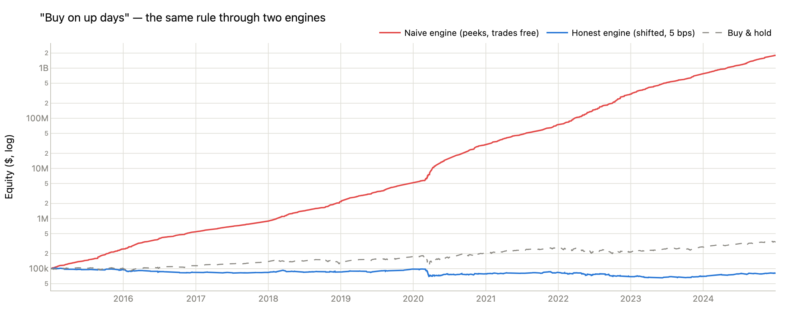
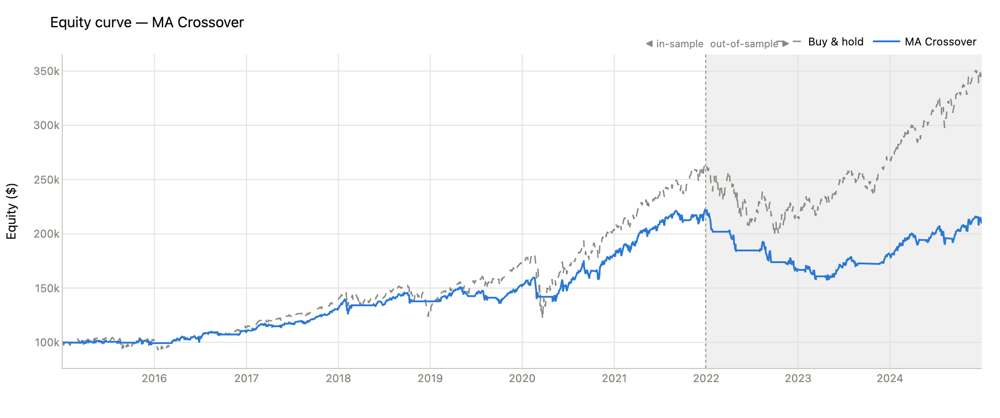
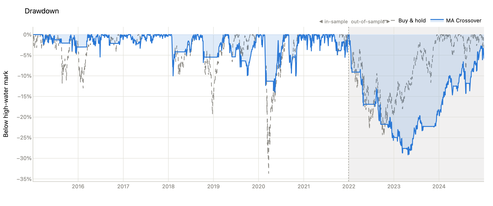
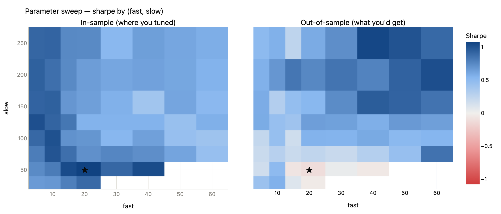
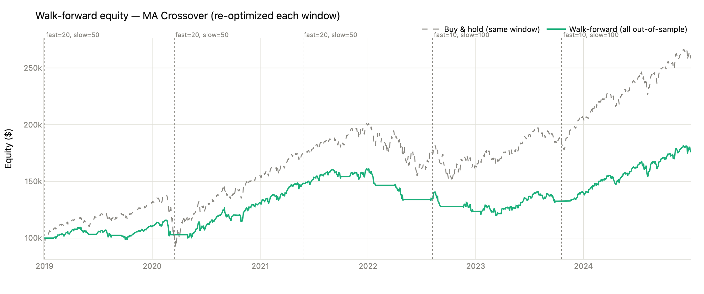

# QuantLab — an honest algorithmic-trading backtester

**[Live Demo →](#)** *(Streamlit Cloud — link coming after deploy)*

Most people's first backtest is a lie. It trades for free, it acts on prices that hadn't
printed yet when the "decision" was made, and its parameters were tuned on the very history
it's graded on. QuantLab is a Python backtesting engine built around closing those three
loopholes — and then *measuring what's left*, which is usually far less than the fantasy
version promised.

The strategies inside (moving-average crossover, RSI mean-reversion, Bollinger breakout) are
deliberately simple and famous. The point was never to find alpha; it's the **evaluation
harness**: shifted signals, transaction costs, chronological train/test splits, walk-forward
re-optimization, and bootstrap confidence intervals. The skill on display is *"I can tell you
honestly whether a strategy works"* — not *"I found a strategy that backtests well."*



The chart above is the project's thesis in one picture. The rule is `buy on up days` — a
signal that (subtly, plausibly) uses each day's own close. Run naively, it compounds $100k
into **$1.8 billion** over a decade of SPY. Run through the honest engine — signal delayed
one bar, 5 bps per trade — the *identical rule* ends at **$80,884**, below the $339,574 of
just buying and holding. Every "too good to be true" backtest screenshot you've seen lives
somewhere on that red curve.

---

## Case study: MA Crossover on SPY, 2015–2025

*(All numbers generated by `scripts/run_case_study.py` — SPY daily, dividend-adjusted,
70/30 chronological split at 2021-12-30, 5 bps per trade, $100k start.)*

### Act 1 — The seductive in-sample number

Tune a 20/50-day moving-average crossover on 2015 → 2021 and it looks like a career-maker:
**Sharpe 1.08 vs buy-and-hold's 0.88**, a +12.1% CAGR with barely a third of the market's
worst drawdown (-14.1% vs -33.7%).

| In-sample (2015 → 2021-12-30) | CAGR | Sharpe | Sortino | Max drawdown | Win rate | Exposure |
|---|---|---|---|---|---|---|
| MA Crossover (20/50) | +12.1% | **1.08** | 1.48 | -14.1% | 55.7% | 73.0% |
| RSI Mean-Reversion (14, 30/70) | +4.9% | 0.41 | 0.57 | -28.3% | 54.3% | 33.6% |
| Bollinger Breakout (20, 2σ) | +0.9% | 0.20 | 0.26 | -9.7% | 52.6% | 29.9% |
| **Buy & hold** | +14.9% | 0.88 | 1.21 | -33.7% | 55.6% | ~100% |

### Act 2 — Out-of-sample, the edge is not just smaller. It's negative.

The last 30% of the window (2022 → 2025) was never touched during tuning. The crossover
didn't merely regress — it **lost money while the market made +8.6% a year**:

| Out-of-sample (2021-12-30 → 2025) | CAGR | Sharpe | Sortino | Max drawdown | Win rate | Exposure |
|---|---|---|---|---|---|---|
| MA Crossover (20/50) | **-2.0%** | **-0.11** | -0.15 | -29.2% | 51.1% | 63.2% |
| RSI Mean-Reversion (14, 30/70) | +7.0% | 0.54 | 0.80 | -20.6% | 49.4% | 45.6% |
| Bollinger Breakout (20, 2σ) | +2.4% | 0.34 | 0.50 | -10.9% | 50.9% | 35.8% |
| **Buy & hold** | +8.6% | 0.56 | 0.80 | -24.5% | 52.7% | 100% |

The app prints this verdict automatically:

> 🚨 **Overfitting red flag:** profitable in-sample (Sharpe 1.08) but LOSES money
> out-of-sample (Sharpe -0.11). The in-sample edge was probably fit to that specific
> stretch of history.




What happened is visible in the equity curve: trend-following printed money in the smooth
2016–2021 bull market, then 2022's whipsaws chopped it to pieces and it sat in cash through
chunks of the 2023–24 rally it needed to recover.

### Act 3 — It wasn't bad luck. The whole neighborhood was overfit.

Sweep all 58 valid (fast, slow) combinations and paint in-sample vs out-of-sample Sharpe:



The ★ marks the in-sample champion — which happens to be **the textbook default, 20/50**.
Out-of-sample it ranks **#58 of 58**: dead last in the very grid it topped. When your
optimizer's favorite cell goes from the bluest square to a pale red one, you didn't find
signal — you memorized noise. (Notice the *out-of-sample* winners hide in the slow, boring
top-right corner nobody would have picked in 2021.)

And here's the kicker — **the champion's 1.08 was never impressive to begin with.** Even if
all 58 combos were pure noise, the expected *best* in-sample Sharpe from 58 zero-skill tries
on this window is **≈0.88** (`stats.expected_max_sharpe`, the Bailey–López de Prado
expected-maximum under the null). Selection bias alone was guaranteed to hand the sweep a
"winner" at 0.88; observing 1.08 barely clears the bar that luck sets.

### Act 4 — Walk-forward: the honest way to optimize (and its humble result)

If picking parameters once is overfitting, re-pick them the way a live trader would: optimize
on an expanding window, trade the *next* unseen segment, repeat. Every bar of this curve is
out-of-sample:



| | Sharpe |
|---|---|
| Hindsight-optimized on the full sample (fast=10, slow=100) | 0.85 |
| **Walk-forward, all out-of-sample** | **0.79** |
| Buy & hold, same window | **0.90** |

Walk-forward *rescues* the strategy from the single-split disaster (Sharpe 0.79 vs -0.11) —
adapting parameters genuinely helped. But the honest headline is the last row: after doing
everything right, disciplined optimization still **didn't beat buying and holding**.

### Act 5 — Is any of it even statistically real?

One history is one sample. A moving-block bootstrap (21-day blocks, 2,000 resamples,
preserving volatility clustering) puts error bars on the out-of-sample Sharpe:

| Strategy | OOS Sharpe | 95% CI | P(Sharpe ≤ 0) |
|---|---|---|---|
| MA Crossover | -0.11 | [-1.03, 1.24] | 44% |
| RSI Mean-Reversion | 0.54 | [-0.40, 1.60] | 13% |
| Bollinger Breakout | 0.34 | [-0.49, 1.46] | 16% |

**Every interval straddles zero.** Three years of daily data cannot statistically
distinguish any of these strategies from no edge at all — and a tool that says so out loud
is worth more than one that reports 0.54 as if it were fact.

### Act 6 — The risk lens: beta, alpha, and sizing by volatility

Regress each strategy's out-of-sample returns on SPY's (CAPM) and the "edge" decomposes
into market exposure plus not much:

| Strategy (out-of-sample) | Beta | Alpha (ann.) | R² | Information ratio |
|---|---|---|---|---|
| MA Crossover | 0.44 | **-5.7%** | 0.44 | -0.85 |
| RSI Mean-Reversion | 0.68 | +1.2% | 0.68 | -0.20 |
| Bollinger Breakout | 0.20 | +0.7% | 0.20 | -0.46 |

Every information ratio is negative: net of what a scaled index position would have
delivered, none of these strategies added value. (Spot the structural identity: for an
on/off strategy trading its own benchmark, R² ≈ β ≈ time in market — the "strategy" is
mostly just intermittent index exposure.)

Position **sizing**, though, is a different story. Scale a plain buy-and-hold by
`target ÷ realized volatility` (10% target, 20-day estimate, never levered above 1×) and
out-of-sample:

| | Volatility (ann.) | Sharpe | Max drawdown | CAGR |
|---|---|---|---|---|
| Buy & hold | 17.5% | 0.56 | -24.5% | +8.6% |
| **Vol-targeted buy & hold** | **10.4%** | **0.70** | **-12.9%** | +7.0% |

Same asset, no forecast, no signal — just *risk discipline* — and the Sharpe improves while
the worst drawdown halves. The honest moral of the whole case study: in this data, managing
**risk** paid; predicting **direction** didn't.

### Epilogue — costs, the quiet killer

| Cost per trade (MA 20/50, out-of-sample) | OOS CAGR | OOS Sharpe |
|---|---|---|
| 0 bps (fantasy) | -1.7% | -0.09 |
| 5 bps (liquid ETF) | -2.0% | -0.11 |
| 10 bps | -2.2% | -0.14 |
| 25 bps (small-cap reality) | -3.0% | -0.20 |

A ~40-trade strategy loses another ~1.3% of CAGR moving from fantasy costs to small-cap
costs. Strategies that trade daily get erased by this line item alone.

---

## The app

`streamlit run src/app.py` — or the live demo above.

| Tab | What it shows |
|---|---|
| 📈 **Backtest** | Pick ticker, dates, strategy, parameters, split, cost — and optionally volatility targeting. Equity + drawdown vs buy-and-hold with the out-of-sample region shaded, side-by-side in/out-of-sample metrics, an automated overfitting verdict, an out-of-sample CAPM row (beta / alpha / R² / information ratio), a rolling 1-year Sharpe, a bootstrap CI on the out-of-sample Sharpe, and a round-trip trade ledger. |
| 🔁 **Walk-Forward** | Anchored walk-forward optimization over a parameter grid: the all-out-of-sample equity curve, per-window chosen parameters (watch them jump — that's fragility), and the "reality gap" vs the hindsight-optimized Sharpe. |
| 🔥 **Parameter Sweep** | The in-sample vs out-of-sample heatmap pair for the current ticker, with the in-sample champion starred and its out-of-sample rank computed. |
| 📚 **Methodology** | The three lies and their fixes, plus the naive-vs-honest engine demo run live on your chosen ticker. |

## Architecture

```
src/
├── data.py          yfinance daily OHLCV → parquet cache (data/cache/, sidecar
│                    range metadata so covered requests never re-hit the network)
├── engine.py        the honest core: position[t] = signal[t-1]  ← the look-ahead guard
│                    cost = |Δposition| × cost_bps; equity compounds net daily returns
│                    (+ run_naive_backtest_do_not_use, kept as the cautionary foil)
├── strategies/      registry pattern: @register_strategy exposes name → signal fn
│   ├── base.py      contract: (prices, **params) → Series in {-1, 0, 1}, causal
│   ├── ma_crossover.py · rsi.py (Wilder) · bollinger.py
├── metrics.py       CAGR, Sharpe, Sortino, max drawdown (+dates), win rate, exposure,
│                    CAPM alpha/beta/R², information ratio, rolling Sharpe
├── evaluate.py      chronological split · segment metrics · overfitting verdict · figures
├── sizing.py        volatility-targeted position sizing (fractional, never levered)
├── walkforward.py   anchored expanding-window optimization, chained OOS curve
│                    (seam transitions charged at actual position change)
├── sweep.py         param grid → IS/OOS surface, champion-rank analysis
├── trades.py        position series → round-trip ledger, per-trade stats
├── stats.py         moving-block bootstrap CI · expected-max-Sharpe luck yardstick
└── app.py           Streamlit UI
tests/               142 pytest tests — see below
scripts/             check_data.py · run_case_study.py (regenerates everything above)
```

**The one line that matters** (engine.py): a signal computed at day *t*'s close is shifted
one bar before it earns returns — `position = signals.shift(1)` — because you cannot buy at
a price that finished printing before you decided. Everything else in the repo exists to
protect, test, and quantify the consequences of that discipline.

**Why signals are computed once on the full series** (evaluate.py): every indicator here is
causal — a rolling mean at date *t* uses only bars ≤ *t* — so computing them over the full
history leaks nothing into the out-of-sample segment, while *recomputing per segment* would
punch an indicator warm-up hole in it. What makes data out-of-sample is that parameters were
never *chosen* by looking at it.

## Tests

142 tests, all offline except one marked live-data check (`-m "not network"` to skip it):

- **Look-ahead proof:** a signal that peeks at its own bar's return turns an alternating
  series into a money machine in the naive engine and loses in the honest one.
- **Cost accounting:** a single flip charges exactly one `cost_bps`; a long→short reversal
  charges exactly two; constant-long reproduces manual buy-and-hold net of one entry fee
  (and matches real SPY CAGR to < 1 bp).
- **Metric identities:** hand-computed Sharpe/Sortino/CAGR/drawdown cases, the
  Sortino ≈ √2 × Sharpe symmetric-returns identity, drawdown peak/trough/recovery dates.
- **Split hygiene:** segments are disjoint, exhaustive, chronological; segment metrics are
  re-based so the first out-of-sample day's return isn't dropped.
- **Walk-forward mechanics:** test windows tile the timeline without gap or overlap,
  training is strictly earlier data, invalid grid combos are skipped.
- **Bootstrap:** deterministic under a seed, CI brackets the point estimate, a demeaned
  series straddles zero.
- **Risk lens:** CAPM regression recovers constructed betas/alphas exactly; vol targeting
  provably pulls realized volatility toward its target and is causally safe (the scale at
  bar *t* is identical when computed with all future data deleted).

## Interview talking points

1. **"How does a backtest lie?"** Look-ahead (the naive engine demo: $1.8B), free trading
   (the cost table), and overfitting (the sweep heatmap: in-sample champion, #58/58
   out-of-sample). Each has a guard in the code and a test proving the guard works.
2. **"What does Sharpe actually measure — and when does it mislead?"** Mean excess return
   per unit of volatility, annualized √252; assumes roughly i.i.d., symmetric returns.
   Complement with Sortino (downside-only denominator), max drawdown (path pain), and a
   bootstrap CI (sampling error — all three strategies' CIs straddle zero here).
3. **"Why chronological splits? Why walk-forward?"** Shuffled splits let the future leak
   backwards. A single split can still be gamed by re-tuning until the holdout looks good —
   walk-forward re-optimizes honestly and the 0.85 → 0.79 "reality gap" prices what
   hindsight was worth.
4. **"What actually added value here?"** Not signal timing — every strategy's information
   ratio is negative, and CAPM shows they were mostly intermittent index exposure (R² ≈ β
   for on/off strategies). What worked was *risk discipline*: volatility targeting on plain
   buy-and-hold raised the Sharpe from 0.56 to 0.70 and halved the max drawdown, with no
   prediction at all. That asymmetry — sizing beats forecasting — is one of the most robust
   findings in the volatility-managed-portfolio literature, and it fell out of the data here.

## Honest limitations (know what this isn't)

- Daily bars, executed at closes; no intraday fills, no slippage model beyond flat bps,
  no borrow costs on shorts, no position sizing beyond ±1/0.
- Single-instrument backtests: no portfolio effects, and testing only on SPY (an index that
  by construction survived) sidesteps but doesn't solve survivorship bias — test on
  delisted names and the data itself gets harder.
- The bootstrap preserves monthly-scale clustering but not regime persistence beyond the
  block length.
- Yahoo Finance data is free and occasionally revised; the parquet cache pins what you saw.

## Run it

```bash
git clone https://github.com/abaooba/quantlab.git && cd quantlab
pip install -r requirements.txt
streamlit run src/app.py          # the app
pytest -m "not network"           # the test suite (offline)
python scripts/run_case_study.py  # regenerate every number in this README (needs -r requirements-dev.txt)
```

No API keys — yfinance reads public Yahoo Finance endpoints.

---

*Built by Ares Cajas as part of a quantitative-finance portfolio. Educational software:
nothing here is investment advice, and no backtest — however honest — is a promise about
the future.*
